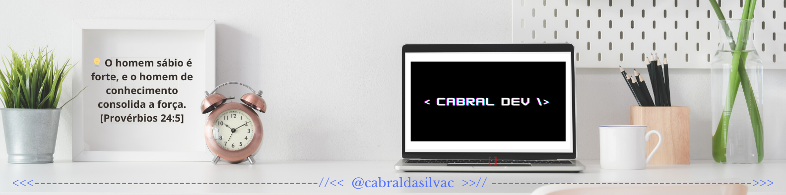

<!--

-->
<h1 align="left"> 
    Olá, Eu sou o Wanderley Cabral
</h1>

 

- ✅ Graduado em Análise e Desenvolvimento de Sistemas
- 🔥 Pós-Graduando em Desenvolvimento Full Stack na Faculdade Descomplica. 
- 💬 Pergunte-me sobre. **JavaScript, HTML, CSS, SQL, Node.JS, Python, Java**
- 👨‍💻 Saiba mais sobre a minha jornada de estudos na Faculdade. [Clique aqui!](https://website-red-eight.vercel.app/)
- 

    

        <h2>🛠 &nbsp;Tech Stack</h2>

&nbsp;
&nbsp;
&nbsp;
&nbsp;
&nbsp;
&nbsp;
&nbsp;
&nbsp;
&nbsp;
&nbsp;
&nbsp;
&nbsp;
&nbsp;
&nbsp;

<h2>Skills acquired in College</h2>

&nbsp;

    <h2 align="left" > Conheça alguns dos projetos que desenvolvi para fixar aprendizado!</h2>

   
    
    

        <ul>
            <li> 1 - Calculadora ✅ - [Calculadora Java](https://github.com/cabraldasilvac/calculadora-java)</li>
            <li>2 - Blog ✅ - [fetch-api](https://github.com/WMS66/fetch-api)</li>
            <li>3 - Sistema de Cadastro de Usuário ✅ - [Cadastro de DEVs](https://github.com/WMS66/formulario_cadastro_devs)</li>
            <li>4 - Lista de Tarefas - CRUD ✅ - [Lista de Tarefas](https://github.com/cabraldasilvac/lista-de-tarefas)</li>
            <li>5 - Clonar um site ou um App ✅ - [Hero_Header](https://github.com/cabraldasilvac/Hero-Header-Frontend)</li>
            <li>6 - Página de Catálogo ✅ - [catalog-of-products-and-services](https://github.com/WMS66/catalog-of-products-and-services)</li>
            <li>7 - Criar um jogo ✅ - [Jogo da velha](https://github.com/WMS66/jogodavelha)</li>
            <li>8 - Calendário ✅ - [Calendário](https://github.com/WMS66/calendario)</li>
        </ul>
    

    <h2> Meus Últimos Posts do Medium</h2>

 <!-- BLOG-POST-LIST:START -->
- [ A Arte e Ciência da Arquitetura Front-end](https://medium.com/@wcabraldasilvac/arquitetura-front-end-ad77306b2f5f?source=rss-4b15f2a315f5------2)
- [Git e GitHub — Conceitos e comandos Iniciais](https://medium.com/@wcabraldasilvac/git-e-github-conceitos-e-comandos-iniciais-6a9690778f2a?source=rss-4b15f2a315f5------2)
<!-- BLOG-POST-LIST:END -->

<a href="https://github.com/cabraldasilvac">
    <h2>⚙️ &nbsp;GitHub Stats</h2>
         
        

###

    

  

###
